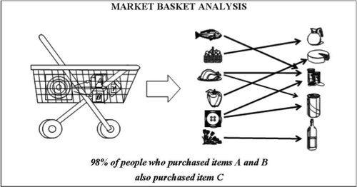

## R 的幾種學習法 (各方法具互補性)

  * 傳統課堂上機教學與實作
    + 按部就班式
    + 解題式
        - [手把手教你 R 語言資料分析實務 (1)](http://www.slideshare.net/tw_dsconf/r-70971199)
        - [手把手教你 R 語言資料分析實務 (2)](http://www.slideshare.net/tw_dsconf/r-64232974)
        - ...
  * 線上互動式與自主式學習 (循序漸進)
    + [Code School](https://www.codeschool.com/courses/try-r)
    + [Datacamp](https://www.datacamp.com/courses/q:R)
    + [R 語言翻轉教室](http://datascienceandr.org/) (大推！具豐富的教學資源)
    + ...


## 研討大綱
  * Introduction
  * Data Manipulation: {reshape2} + {plyr} / **{tidyr} + {dplyr}**
    + Web Scraping: {RCurl}, {XML}
  * Data Visualization: {ggplot2}, {googleVis}, {ggmap}, {dygraph}
  * Reproducible Resarch: {knitr}
  * Application (Quantative Investment): {qunatmod}, {quantstrat}
  * Data Analysis (Data Mining): {rpart}, {C50}, {e1071}, {neuralnet}, {randomForest}, {adabag}, {NbClust}, {GA}, {ABCoptim}, {arules}, {wordcloud}
    + Big Data Analysis: {rmr2} (不建議使用), [{sparklyr}](http://spark.rstudio.com/)
  

## R 語言？
  [](http://www.revolutionanalytics.com/what-r)


## 為何要用 R？
  * 很多專業機構說她真的很棒！
    + [KDnuggets: R, Python Duel As Top Analytics, Data Science software – KDnuggets 2016 Software Poll Results](http://www.kdnuggets.com/2016/06/r-python-top-analytics-data-mining-data-science-software.html)
    + [IEEE: The 2016 Top Ten Programming Languages](http://spectrum.ieee.org/computing/software/the-2016-top-programming-languages)

  * 超級多的套件：應用性超快且廣
    + [CRAN Task Views](https://cran.r-project.org/web/views/)
    + [CRAN 套件統計](https://www.rstudio.com/rviews/2017/01/06/10000-cran-packages/) [2017-1-6 突破 1 萬個套]
    
  * 全世界都在用她：問題很快能被解答
    + [Stack Overflow 超多人在討論](http://www.r-bloggers.com/the-most-popular-programming-languages-on-stackoverflow/)


## R 的核心 (Base / Core)
  * [CRAN: The Comprehensive R Archive Network](https://cran.r-project.org/)
    + [RTools](https://cran.r-project.org/bin/windows/Rtools/)
  * [MRO: Microsoft R Open](https://mran.microsoft.com/open/)


## 常見的 R 語言之整合開發環境 IDE 
  * [RStudio](https://www.rstudio.com/)
    + [RStudio Stable](https://www.rstudio.com/products/rstudio/download/)
    + [RStudio Preview](https://www.rstudio.com/products/rstudio/download/preview/)

  * [jupyter notebook](http://jupyter.org/)
    + [Anaconda](https://www.continuum.io/downloads)
    + [Using R with jupyter notebook](http://blog.revolutionanalytics.com/2015/09/using-r-with-jupyter-notebooks.html)
  * [RTVS: R for Visual Studio](http://blog.revolutionanalytics.com/2016/03/rtvs-preview.html)
  * [Eclipse for R Program](http://www.quantlego.com/howto/eclipse-as-ide-for-r/)


## Anaconda > jupyter notebook (請見講師操作)
  * [jupyter notebook](http://jupyter.org/)
  
    + [Anaconda](https://www.continuum.io/downloads)
    
    + [Using R with jupyter notebook](https://github.com/IRkernel/IRkernel)

    + [RISE: "Live" Reveal.js Jupyter/IPython Slideshow Extension
](https://github.com/damianavila/RISE)


## RStudio 重要設定：核心版本切換
  * 版本 / 位元 (64 bit vs. 32 bit)
  
    
    

## RStudio 重要設定：編碼方式切換 
  * BIG5 vs. UTF-8
  
    


## RStudio IDE
  * 


## RStudio 重點指令 (Windows 作業系統)
  * 善用 **Tab 鍵** ：自動完成
  * Ctrl + Enter : 執行單行指令
  * Ctrl + Shift + s :執行全部指令
  * **Ctrl + Shift + c** :註解指令
  * **Ctrl + c** ：中斷執行
  * Ctrl + L : 清除 Console 視窗
  * 查詢方式
    + ?精確函式名稱，如：?read.table
        - help(精確函式名稱) 亦同，但 help() 的用途更廣，如：help(package = 'xlsx') 可查套件
    + ??模糊函式名稱，如：??read.ta 
        - help.search('模糊函式名稱') 亦同
  * 指令 rm(list = ls()) 可清除所有 Environment 的內容
  * options(digits = N) 可設定 Console 視窗的數值顯示精確位數
  * **[RStudio IDE Cheat Sheet](http://www.rstudio.com/wp-content/uploads/2016/01/rstudio-IDE-cheatsheet.pdf)**
  
## R 套件 (Package) 的來源 & 安裝與加載
  * [CRAN Package by Name](https://cran.r-project.org/web/packages/available_packages_by_name.html)

```{r, echo=TRUE, eval=FALSE}
install.packages('套件名稱')  # 安裝套件: install.packages()
install.packages('套件名稱', dependencies = TRUE)
install.packages('套件名稱', type = 'source')
```

```{r, echo=TRUE, eval=FALSE}  
library(套件名稱)  # library() vs require(): https://yihui.name/en/2014/07/library-vs-require/
require(套件名稱)
```
      
```{r, echo=TRUE, eval=FALSE}
if (!require(套件名稱)) install.packages('套件名稱')
library(套件名稱)
```
  
  * [CRAN Task Views](https://cran.r-project.org/web/views/)

```{r, echo=TRUE, eval=FALSE}
install.packages("ctv")
library("ctv")
install.views("Econometrics")
```  
  
  * [R-Forge](https://r-forge.r-project.org/)
  
```{r, echo=TRUE, eval=FALSE}
# {quantstrat}: # https://r-forge.r-project.org/R/?group_id=316
install.packages("quantstrat", repos="http://R-Forge.R-project.org")
```  
  
  * [Github](https://github.com/trending/r)

```{r, echo=TRUE, eval=FALSE}
if (!require(devtools)) install.packages('devtools')
# Windows 下須先安裝 RTools: https://cran.r-project.org/bin/windows/Rtools/
library(devtools)
install_github('tidyverse/ggplot2')  # https://github.com/tidyverse/ggplot2
#install_github(repo = "ggplot2", username = "tidyverse")
```

## 分析過程 (Analytic Process)

1. 資料操作 (Data Manipulation)
2. 資料視覺化 (Data Visualization)
3. 資料分析 (Data Analysis / Data Modeling)
4. 分析呈現 (Reporting)


## R 資料操作：基礎篇 (請見講師操作)
  * 資料元素型態 (numeric / string / factor / ordered factor / **datetime** / ...)
  * 資料容器類型 (**vector** / matrix / array / **list** / **data.frame** / **tibbles** ...)
  * 程式流程控制
    + 條件控制 (if-else / ifelse / switch)
    + 迴圈迭代 (for / while / repeat + break / continue)
    + 向量化 (**apply family**: sapply / mapply / apply / tapply / lapply / ...)
  * 資料 I/O (txt / **csv** / **xls / xlsx** / **html / xml** / **json** / ...)
  * 資料處理
    + 資料指標 (Indexing)
    + 資料排序 (Sorting)
    + 子集取用 (Subseting)
    + 重直整併 (Appending)
    + 水平整併 (Merging) 
    + 格式轉換 (Long Format <-> Wide Format)
    + 資料聚合 (Aggregating / Grouping)
  * 時間計算 (system.time() / proc.time())
  * 異常處理 (try / tryCatch)


## 資料元素型態
```{r, echo=TRUE, eval=FALSE}
a <- 1
a
class(a)  # numeric

a <- 'string'
a
class(a)  # character

a <- c('A', 'B', 'A')
a <- factor(a)
a
levels(a)
class(a)  # factor

a <- Sys.time()
a
class(a)
```

## 資料容器型態

  * assign operator: **<-** vs. = (建議使用 <-，原因...)
  
```{r, echo=TRUE, eval=FALSE}
temp <- 27   # 建議使用 <-，其在進階使用上比較不會有問題！如：運算時間的計算、eval() 的使用 等
temp = 27
```

  * vector (R 語言的最基本資料型態)

```{r, echo=TRUE, eval=FALSE}
vec <- c(27, 28, 29, 30)   # 注意：英文字母大小寫有別！ V vs. v

class(vec)  # class() 查詢物件的型態
length(vec)  # 查詢長度

vec[2]  # 索引指標 indexing
vec[1:2]
vec[c(2,4)]

vec > 28       # idx <- vec > 28
vec[vec > 28]  # vec[idx]

vec <- vec * 1.8 + 32  # 向量化操作 vectorized operation (vectorization)]=
vec

`向量` <- c(27, 28, 29, 30)  # 中文亦可，用 ` ` 包起來命名，但不建議！(Encoding 問題！)
`向量`
```
  
  * matrix

```{r, echo=TRUE, eval=FALSE}
vec <- 1:12
class(vec)

mat1 <- matrix(vec, nrow = 3, ncol = 4, byrow = FALSE)  # matrix()：生成 matrix
mat1

mat1[3, ]  # 索引指標 indexing
mat1[ ,4]

mat2 <- matrix(vec, nrow = 3, ncol = 4, byrow = TRUE)
mat2

mat2[3, 4] <- 8
mat2

dim(mat1)  # dim()：查詢維度
dim(mat1)[1]
dim(mat1)[2]
nrow(mat1)  # nrow()：查詢 row 數
ncol(mat1)  # ncol()：查询 col 數

t(mat1)  # t()：矩陣轉置
mat1 %*% t(mat2)  # %*%：矩陣相乘
```


  * data.frame 資料框 (最常見的資料)

    + [data.frame vs. tibble (新資料型態)](http://r4ds.had.co.nz/tibbles.html)

```{r, echo=TRUE, eval=FALSE}
city <- c('A', 'B', 'C', 'D')
temp <- c(27, 29, 23, 14)
DF0 <- data.frame(temp, city, stringsAsFactors = FALSE)  # data.frame() 建構 data.frame 容器
DF0
class(DF0)

# 擴增欄位 Merging
country <- c('TW', 'SI', 'HK', 'US')
cbind(DF0, country)  # cbind(): 橫向整併

DF0$country <- c('TW', 'SI', 'HK', 'US')  # 增加 data.frame 的欄位與資料
DF0

# 擴增紀錄 Appedning
rec <- c(32, 'E', 'TW')  # 注意欄位的順序得正確
DF0 <- rbind(DF0, rec)

DF1 <- data.frame(temp = 30, country = 'TW', city = 'K')   # 欄位的順序不重要
DF0 <- rbind(DF0, DF1)
DF0

# Sorting 排序
DF0[order(temp), ]  # order() 遞增排序

DF0[order(temp, decreasing = TRUE), ]  # 遞減排序

# 欄位順序重組
DF0 <- DF[c('City', 'Temp')]  # Reordering the columns in a data frame http://www.cookbook-r.com/Manipulating_data/Reordering_the_columns_in_a_data_frame/
DF0

# 內建資料集 mtcars
DF <- mtcars  # mtcars 為內建資料集

class(DF)
str(DF)
head(DF)
tail(DF, n = 10)

head(DF); tail(DF)

DF[ ,1]  # 提取特定 col，還傳均為 vector 型態
DF$mpg
DF[[1]]

DF['Mazda RX4 Wag', 'mpg']

DF[2, ]  # 提取特定 row
DF['Mazda RX4 Wag', ]

DF[DF$mpg > 25, ]  # 提取符合特定規則的 rows

DF[DF$mpg > 25 & DF$disp > 80, ]  # 多重規則
with(data = DF,                   # with()
  DF[mpg > 25 & disp > 80, ]
)
subset(DF, mpg > 25 & disp > 80)  # subset()
```


  * list 列表 (最靈活的資料型態， R 分析回傳結果的資料型態多為此類)

```{r, echo=TRUE, eval=FALSE}
City <- c('A', 'B', 'C', 'D')
Temp <- c(27, 29, 23, 14)
ls <- list(city = City, temp = Temp)
ls
class(ls)
str(ls)

names(ls) <- c('City', 'Temp')  # names() 欄位命名函式
ls

ls$Mat <- Mat
ls$DF <- DF0
ls
names(ls)

class(ls[3])
class(ls[[3]])
class(as.matrix(ls[3]))  # 強迫轉換資料型別含是 as.*() ex. as.vector() / as.matrix() / as.data.frame() / as.list() ...
class(ls$DF)
```  

  * 資料 / 容器 型別轉換函式 as.*() family
    + 資料元素型別轉換函式：as.integer() / as.numeric() / as.character() / as.Date() / ...
    + 資料容器型別轉換韓式：as.vector() / as.matrix() / as.list() / as.data.frame() / as_tibble() {tibbles} ...


## 程式流程控制
  * 條件控制 (if-else / ifelse / switch)
    + if-else / ifelse
    
```{r, echo=TRUE, eval=FALSE}
num <- 7

# if
if (num %% 2 != 0) cat(num, 'is odd')

# if-else
if (num %%  != 0){
  cat(num, 'is odd')
} else {
  cat(num, 'is even')
}

# if-elseif-else
if (num %% 3 == 1){
  cat('mode is', 1)
} else if (num %% 3 == 2) {
  cat('mode is', 2)
} else {
  cat('mode is', 0)
}

# ifelse()
set.seed(100)
X <- sample(1:100, 5, replace = TRUE)
X
ifelse(X %% 2 != 0, yes = 'odd', no = 'even')  # ifelse 可以進行向量化運算 vectorized operation (vectorization)
```


    + switch
```{r, echo=TRUE, eval=FALSE}
num <- 7
Mode <- num %% 2
switch(Mode, switch(Mode+1, 0, 1,2))
```


  * 迴圈迭代 (for / while / repeat + [break / next])
    + for 
    
```{r, echo=TRUE, eval=FALSE}
set.seed(100)
X <- sample(1:100, 5, replace = TRUE)
X

N <- length(X)
Sum <- 0
for (i in 1:N){
  Sum <- Sum + X[i]
}
Mean <- Sum / N
Mean

mean(X)  # sum(X) / length(X)
```


    + while
    
```{r, echo=TRUE, eval=FALSE}
N <- length(X)

Sum <- 0
i = 1
while (i <= N){
  Sum <- Sum + X[i]
  i <- i + 1
}
Mean <- Sum / N
Mean
```


    + repeat + break / next
    
```{r, echo=TRUE, eval=FALSE}
N <- length(X)
Sum <- 0
i = 1
repeat{
  Sum <- Sum + X[i]
  i <- i + 1
  if (i > N) {
    break
  } else {
    next
  }
}
Mean <- Sum / N
Mean
```


  * 向量化 (**apply family**: sapply / apply / lapply /tapply / mapply / ...)

    + sapply：欲操作函式的引數 argument "僅有一個" 時的向量化運算函式
    
```{r, echo=TRUE, eval=FALSE}
str(iris)

CV <- function(X){
  return(sd(X) / mean(X))
}

res <- sapply(X = iris[,1:4], FUN = CV)  # sapply(iris[,1:4], CV)
res
class(res)  # sapply 的輸出結果為 vector
```


    + apply：具方向性的向量化操作
    
```{r, echo=TRUE, eval=FALSE}
apply(iris[,1:4], MARGIN = 2, CV)  # MARGIN = 2: by col
apply(iris[,1:4], MARGIN = 1, CV)  # MARGIN = 1: by row
```


    + lapply：輸出為 list 的 *apply 函式
    
```{r, echo=TRUE, eval=FALSE}
res <- lapply(iris[,1:4], CV)
res
class(res)  # lapply 的輸出結果為 list
```


    + tapply：分群統計的 *apply 函式
    
```{r, echo=TRUE, eval=FALSE}
tapply(X = iris$Sepal.Length, INDEX = list(iris$Species), FUN = CV)

# aggregate() 分群統計
with(iris, aggregate(Sepal.Length, by = list(Species), FUN = CV))
aggregate(data = iris, Sepal.Length ~ Species, FUN = CV)

iris$Level <- with(iris,    # 擴充 data.frame 欄位
              cut(Sepal.Length, breaks = c(min(Sepal.Length), mean(Sepal.Length), max(Sepal.Length)), labels = c('Low', 'High'))
              )

aggregate(data=iris, Sepal.Length ~ Species + Level, FUN = CV)

# by() 分群統計
with(iris,
     by(Sepal.Length, INDICES=list(Species, Level), FUN = CV)   # 對某變數進行分組摘要統計
)

# aggregate() 比 tapply() 功能更強，但建議用 {dplyr} 為之 (後續說明)
```


    + mapply：欲操作函式的引數 arguments 有 "兩個以上" 時的向量化運算函式
    
```{r, echo=TRUE, eval=FALSE}
# 生成九九乘法表
vec1 <- vec2 <- 1:9
para <- expand.grid(vec1, vec2) # expand.grid
class(para)
res <- mapply(FUN = prod, para[,1], para[,2])
matrix(res, nrow = length(vec1), ncol = length(vec2))
```


## 資料 I/O (txt / **csv** / **xls / xlsx** / **json** / **htm / html / xml** / ...)
  * txt: tab / 空白 分隔檔案 => read.table()
```{r, echo=TRUE, eval=FALSE}
res <- read.table(file = 'Data0/可能成交指數.txt',    # read.table() 是讀取文字檔的基礎函式 
                  sep = '\t',                # sep 分隔符號，常見有 '\t' (tab 分隔) / ',' / ';' / ...
                  header = TRUE,             # 如果有表頭在檔案的第一列 (支援中文表頭，但不建議) 
                  stringsAsFactors = FALSE,  # stringsAsFactors 是否將讀入的 string 欄位直接轉換為 factor，預設為 TRUE，建議調整為 FALSE
                  fileEncoding = 'BIG5')     # 檔案的編碼格式，常見的有 'UTF-8' / 'UTF-8-BOM' / 'BIG5' / ...
str(res)
#  (相反的函式：write.txt)
```
  
  
  * csv: , / ; 分隔檔案 => read.csv() / read.csv2()
```{r, echo=TRUE, eval=FALSE}
pathname <- 'Data0/'
filelist <- dir(path=pathname, pattern='csv')  # dir() 資料夾探索函式
fullname <- paste(pathname, filename, sep='')  # paste() 中的參數 sep='' 等同於 paste0()
# fullname <- paste0(pathname, fullname)

res <- read.csv(file = fullname,    # read.table() 是讀取文字檔的基礎函式 
                  header = TRUE,             # 如果有表頭在檔案的第一列 (支援中文表頭，但不建議) 
                  stringsAsFactors = FALSE,  # stringsAsFactors 是否將讀入的 string 欄位直接轉換為 factor，預設為 TRUE，建議調整為 FALSE
                  fileEncoding = 'BIG5')     # 檔案的編碼格式，常見的有 'UTF-8' / 'UTF-8-BOM' / 'BIG5' / ...
str(res)
#  (相反的函式：write.csv)
```

  * xls / xlsx: {xlsx} / ... / **{readxl}**
```{r, echo=TRUE, eval=FALSE}
path <- 'Data0/'
pattern <- 'xlsx'
filename <- dir(path = path, pattern = pattern)  # dir() 資料夾探索函式

fullname <- paste0(path, filename)

# {xlsx}: read.xlsx (相反的函式：write.xlsx)
if (!require(xlsx)) install.packages('xlsx')
library(xlsx)
res <- read.xlsx(fullname, 1, encoding = 'UTF-8')     
str(res)

# {readxl}: read_excel()
if (!require(readxl)) install.packages('readxl')
library(readxl)
res <- read_excel(fullname, 1)     
str(res)

# 讀檔效能比較：{xlsx} vs. {readxl}
system.time(read.xlsx(fullname, 1, encoding = 'UTF-8'))  # system.time()：計算時間調取函式 (程式效能評估函式)

system.time(read_excel(fullname, 1))
```

  * json: **{jsonlite}** / {rjson} / {RJSONIO} / ...
```{r, echo=TRUE, eval=FALSE}
if (!require(jsonlite)) install.packages('jsonlite')
library(jsonlite)
#  http://anotherpeak.org/blog/tech/2016/03/10/understand_json_3.html
#  https://rstudio-pubs-static.s3.amazonaws.com/31702_9c22e3d1a0c44968a4a1f9656f1800ab.html

url <- 'http://data.gov.tw/iisi/logaccess/2878?dataUrl=http://file.data.gov.tw/event/dataset.json&ndctype=JSON&ndcnid=8693'
y <- fromJSON(url, flatten = TRUE)
y <- as.data.frame(y$Records)
```

  * htm / html / xml: {XML} / {RCurl} / ...
```{r, echo=TRUE, eval=FALSE}
if (!require(XML)) install.packages('XML')
library(XML)
url <- "http://en.wikipedia.org/wiki/List_of_countries_by_credit_rating"
res <- readHTMLTable(readLines(url), which=3)
str(res)
```

## DIY 練習：讀取 政府資料開放平台 上的 csv / XML / json 檔案格式
  * [目標資料](http://data.gov.tw/node/6076)
  * [實作參考](http://www.idealyzt.com/%E5%A6%82%E4%BD%95%E4%BD%BF%E7%94%A8-r-%E5%8F%96%E5%BE%97%E9%96%8B%E6%94%BE%E8%B3%87%E6%96%99/) 
  
  [](http://data.gov.tw/)
  


## DIY 練習：逐一讀取 ./Data/ 資料夾下的所有 xls 檔，並將個別資料集 垂直整併 (Append) 成為單一資料集

[](images/DIY.jpg)

```{r, echo=TRUE, eval=FALSE}
稍候在共筆公布其中一個解答 (沒有絕對的答案！請使用任何 您知道的技巧多方為之！)
```


## Data Manipulation: Advanced Packages (請見講師操作)

  * [補充：善用 RStudio 的 Cheatsheet！](https://www.rstudio.com/resources/cheatsheets/)

  * [pipeline: %>% Operator](https://rstudio-pubs-static.s3.amazonaws.com/58498_dd3b603ba4fb4b469bb1c57b5a951c39.html#operator)

  * [{tidyr} vs. {reshape2}](https://rstudio-pubs-static.s3.amazonaws.com/58498_dd3b603ba4fb4b469bb1c57b5a951c39.html#tidyr-operations)
    + [gather()](https://rstudio-pubs-static.s3.amazonaws.com/58498_dd3b603ba4fb4b469bb1c57b5a951c39.html#gather-function)
    + [spread()](https://rstudio-pubs-static.s3.amazonaws.com/58498_dd3b603ba4fb4b469bb1c57b5a951c39.html#spread)
    + [separate()](https://rstudio-pubs-static.s3.amazonaws.com/58498_dd3b603ba4fb4b469bb1c57b5a951c39.html#separate-function)
    + [unite()](https://rstudio-pubs-static.s3.amazonaws.com/58498_dd3b603ba4fb4b469bb1c57b5a951c39.html#unite-function)

  * [{dplyr} vs. {plyr} vs. {data.table}](https://rstudio-pubs-static.s3.amazonaws.com/58498_dd3b603ba4fb4b469bb1c57b5a951c39.html#dplyr-operations)
    + [select()](https://rstudio-pubs-static.s3.amazonaws.com/58498_dd3b603ba4fb4b469bb1c57b5a951c39.html#select-function)
    + [filter()](https://rstudio-pubs-static.s3.amazonaws.com/58498_dd3b603ba4fb4b469bb1c57b5a951c39.html#filter-function)
    + [group_by()](https://rstudio-pubs-static.s3.amazonaws.com/58498_dd3b603ba4fb4b469bb1c57b5a951c39.html#group_by-function)
    + [summarise()](https://rstudio-pubs-static.s3.amazonaws.com/58498_dd3b603ba4fb4b469bb1c57b5a951c39.html#summarise-function)
    + [arrange()](https://rstudio-pubs-static.s3.amazonaws.com/58498_dd3b603ba4fb4b469bb1c57b5a951c39.html#arrange-function)
    + [join()](https://rstudio-pubs-static.s3.amazonaws.com/58498_dd3b603ba4fb4b469bb1c57b5a951c39.html#join-functions)
    + [mutate()](https://rstudio-pubs-static.s3.amazonaws.com/58498_dd3b603ba4fb4b469bb1c57b5a951c39.html#mutate-function)


## [{magrittr} pipeline: %>% Operator](https://cran.r-project.org/web/packages/magrittr/vignettes/magrittr.html)
```{r, echo=TRUE, eval=FALSE}
### 傳統寫法
str(mtcars)  # profiling
res <- subset(mtcars, hp > 100)  # subseting
str(res)
res <- aggregate(. ~ cyl, data = res, FUN = mean)  # aggregation
res <- round(res, 2)    # formatting
res <- transform(res, kpl = mpg * 0.4251)  # transformation
print(res)


### {magrittr}: pipeline operator %>%
#   https://cran.r-project.org/web/packages/magrittr/vignettes/magrittr.html

if (!require(magrittr)) install.packages(magrittr)
library(magrittr)

res1 <- 
  mtcars %>%
  subset(hp > 100) %>%
  aggregate(. ~ cyl, data = ., FUN = . %>% mean %>% round(2)) %>%
  transform(kpl = mpg %>% multiply_by(0.4251)) %>%
  print
```


## [{tidyr}](https://rstudio-pubs-static.s3.amazonaws.com/58498_dd3b603ba4fb4b469bb1c57b5a951c39.html#tidyr-operations)
  * [gather()](https://rstudio-pubs-static.s3.amazonaws.com/58498_dd3b603ba4fb4b469bb1c57b5a951c39.html#gather-function)
```{r, echo=TRUE, eval=FALSE}
# if(!require(xlsx)) install.packages('xlsx')   
# HI <- read.xlsx('./Data0/可能成交指數.xlsx', sheetIndex = 1,  encoding="big5")
# str(HI)

if(!require(readxl)) install.packages('readxl')    # {readxl} vs. {read.xlsx}
library(readxl)
HI <- read_excel('./Data0/可能成交指數.xlsx', sheet =  1)
str(HI)
head(HI)
tail(HI)

# separate()
if(!require(tidyr)) install.packages('tidyr')
library(tidyr)
HI1 <- HI %>% separate(年度季別, c('年度','季別'), sep=3)
str(HI1)
head(HI1)

HI1$年度 <- as.numeric(HI1$年度) + 1911
head(HI1)

# unite()
HI2 <- HI1 %>% unite('年度季別', 年度, 季別, sep='')
head(HI2)

## Long format vs. Wide format
# gather()
HI4 <- HI %>% gather('地區', '指數', 全國, 台北市, 新北市, 桃竹地區, 台中市, 台南市, 高雄市)
head(HI4)

# spread()
HI5 <- HI4 %>% spread(地區, 指數)
head(HI5)

# cd_tidyr <- MyDF %>%   (indexQuality, marketValue, coupon)
cd_tidyr <- MyDF %>%  gather(indexQuality, marketValue, coupon)
```  
  

## [{dplyr}](https://rstudio-pubs-static.s3.amazonaws.com/58498_dd3b603ba4fb4b469bb1c57b5a951c39.html#dplyr-operations)  *
  * 
```{r, echo=TRUE, eval=FALSE}
if(!require(dplyr)) install.packages('dplyr')
library(dplyr)

# Subsetting: select()
names(HI1)
## 只做全國分析
sub.HI1 <- HI1 %>% select(年度, 季別, 全國)  # HI1 <- HI1[,c('年度',)]
head(sub.HI1)
## 只做區域分析 (去掉全國)
sub.HI1 <- HI1 %>% select(-全國)   
head(sub.HI1)

# Subsetting: filter()
## 以"年"頻率分析
sub.HI1 <- HI1 %>% 
              filter(季別 == 'Q4') %>% 
head(sub.HI1)

## Practice: select() + filter()
## 去掉不必要的欄位
sub.HI1 <- HI1 %>% 
              filter(季別 == 'Q4') %>% 
              select(-季別)
head(sub.HI1)

## Practice: 
sub.HI <- HI %>% separate(年度季別, c('年度','季別'), sep=3) %>% 
                 filter(季別 == 'Q4') %>% 
                 select(-季別)
sub.HI

## Practice
sub1.HI1 <- HI1 %>% 
              select(-全國) %>%
              filter(季別 == 'Q4') %>%
              select(-季別)
head(sub1.HI1)


# Grouping for Summary Statistics: group_by()  [silent function]
group.MyDF <- MyDF %>% group_by(indexQuality)
head(group.MyDF)

# Summary Statistics: summarize() / summarise()
MyDF %>% summarize(mean.marketValue = mean(marketValue))

group.MyDF %>% summarize(mean.marketValue = mean(marketValue),
                         std.marketValue = sd(marketValue))

dstat.MyDF <- MyDF %>% 
                group_by(Year, indexQuality) %>%
                summarize(mean.marketValue = mean(marketValue),
                          std.marketValue = sd(marketValue))
head(dstat.MyDF)

dstat.MyDF <- MyDF %>% 
  group_by(Year, indexQuality) %>%
  summarize(mean.marketValue = mean(marketValue, na.rm=TRUE), 
            sd.marketValue = sd(marketValue, na.rm=TRUE),
            n.marketValue = n(),
            na.marketValue = sum(is.na(marketValue)))
dstat.MyDF

# arrange() + desc()
arrange.dstat.MyDF <- dstat.MyDF[order(dstat.MyDF$n.marketValue, decreasing=T), ]
arrange.dstat.MyDF

arrange.dstat.MyDF <- dstat.MyDF %>%
                        ungroup() %>%    # 注意，對於有 group_by() 過的 dataset，必須執行此步驟才能做 arrange()   http://stackoverflow.com/questions/27207963/arrange-not-working-on-grouped-data-frame
                        arrange(desc(n.marketValue))
arrange.dstat.MyDF

# mutate()
mutate.MyDF <- MyDF %>%
  mutate(perc_coupon = coupon / 100)  # 注意：這邊只是舉例，留意可能重複的狀況
head(mutate.MyDF)

arrange.dstat.MyDF <- dstat.MyDF %>%
  ungroup() %>%    # 注意，對於有 group_by() 過的 dataset，必須執行此步驟才能做 arrange()   http://stackoverflow.com/questions/27207963/arrange-not-working-on-grouped-data-frame
  arrange(desc(n.marketValue)) %>%
  mutate(Rank = 1:length(n.marketValue))  # 注意：這邊只是舉例，留意可能重複的狀況
arrange.dstat.MyDF


# join() [left_join() / right_join() / inner_join() / full_join() / semi_join() / anti_join() ]
MyDF2 <- merge(MyDF, GSPC.DF, by.x = "valDate", by.y = "date", all.x=T)
MyDF2 <- na.omit(MyDF2)


MyDF3 <- left_join(MyDF, GSPC.DF, by=c('valDate' = 'date')) %>%  # ?left_join: To join by different variables on x and y use a named vector. For example, by = c("a" = "b") will match x.a to y.b.
         na.omit()        # http://stackoverflow.com/questions/26665319/removing-na-in-dplyr-pipe

# 自己試試看別種 join() 【請自行上網查詢 SQL 的 join() 說明】
# MyDF4 <- inner_join(MyDF, GSPC.DF, by=c('valDate' = 'date'))
```


***
<center>  </center>

  
## R 的資料視覺化 (Data Visualization)
  * [ggplot2](http://docs.ggplot2.org/current/)
  * [ggmap](http://blog.gtwang.org/r/r-ggmap-package-spatial-data-visualization/)
  * [dygrpahs](https://rstudio.github.io/dygraphs/)
  * googleVis
    + [CRAN](https://cran.r-project.org/web/packages/googleVis/vignettes/googleVis_examples.html)
    + [Github](https://github.com/mages/googleVis)
    + [Google API](https://developers.google.com/chart/interactive/docs/gallery)
  * [plotly](http://moderndata.plot.ly/interactive-r-visualizations-with-d3-ggplot2-rstudio/)


## {ggplot2} 基本語法

  * 兩個基本函式
    + qplot()：基本繪圖函式
    
```{r, echo=TRUE, eval=FALSE}
# pressure 內建資料集
str(pressure)

library(ggplot2)

qplot(x = temperature, y = pressure, data = pressure)

qplot(temperature, pressure, data = pressure,
      main = 'Vapor Pressure of Mercury')  # 可以透過引數不斷修改圖面

qplot(temperature, pressure, 
      data = pressure,
      main = 'Vapor Pressure of Mercury',
      geom = c('point', 'line'),
      lty = I('dashed'))
```     
    
    + ggplot()：進階繪圖函式 (本次重點)

```{r, echo=TRUE, eval=FALSE}
# 基本三組件：資料集 data + 數據特徵 aes (aesthetic) + 幾何特徵 geom
### ggplot(): data + aes() + geom_

ggplot(pressure, aes(x = temperature, y = pressure)) +
  geom_point()

ggplot(pressure) +
  aes(x = temperature, y = pressure) + 
  geom_point()

ggplot(pressure) +
  aes(x = temperature, y = pressure, colour = 'red') +
  geom_point(colour = 'blue') +
  geom_line(colour = 'green') +
  geom_smooth()

# mtcars 內建資料集
str(mtcars)

str(mtcars)

ggplot(mtcars) +
  aes(x = disp, y = mpg) +
  geom_point()

ggplot(mtcars) +
  aes(x = disp, y = mpg, label = gear) +
  geom_text()

ggplot(mtcars) +
  geom_text(aes(x = disp, y = mpg, label = gear))

lmcoef <- coef(lm(mpg~disp, mtcars))

ggplot(mtcars) +
  aes(x = disp, y = mpg) +
  geom_point() +
  geom_abline(intercept = lmcoef[1], slope = lmcoef[2])
``` 

```{r, echo=TRUE, eval=FALSE}

``` 
  

##  Time Series Plotting: {ggplot2} vs {dygrpahs}
```{r ,tidy=FALSE, results = 'asis'} 
# Plotting Time Series in R using Yahoo Finance data
#   https://www.r-bloggers.com/plotting-time-series-in-r-using-yahoo-finance-data/

library(xts) # 若輸出錯誤訊息，可用 suppressPackageStartupMessages() 包裝起來
library(ggplot2)
library(dygraphs)

# Get IBM and Linkedin stock data from Yahoo Finance (亦可用 {quantmod} 為之)
ibm_url <- "http://real-chart.finance.yahoo.com/table.csv?s=IBM&a=07&b=24&c=2010&d=07&e=24&f=2017&g=d&ignore=.csv"
lnkd_url <- "http://real-chart.finance.yahoo.com/table.csv?s=LNKD&a=07&b=24&c=2010&d=07&e=24&f=2017&g=d&ignore=.csv"
# url 解析

yahoo.read <- function(url){
  dat <- read.table(url, header=TRUE,sep=",")
  df <- dat[,c(1,5)]
  df$Date <- as.Date(as.character(df$Date))
  return(df)}

ibm  <- yahoo.read(ibm_url)
lnkd <- yahoo.read(lnkd_url)

## {ggplot}
ggplot(ibm,aes(Date,Close)) + 
  geom_line(aes(color="ibm")) +
  geom_line(data=lnkd,aes(color="lnkd")) +
  labs(color="Legend") +
  scale_colour_manual("", breaks = c("ibm", "lnkd"),
                      values = c("blue", "brown")) +
  ggtitle("Closing Stock Prices: IBM & Linkedin") + 
  theme(plot.title = element_text(lineheight=.7, face="bold"))

## {dygrpah}
# Plot with the htmlwidget dygraphs
# dygraph() needs xts time series objects
ibm_xts <- xts(ibm$Close, order.by=ibm$Date, frequency=365)
lnkd_xts <- xts(lnkd$Close, order.by=lnkd$Date, frequency=365)

stocks <- cbind(ibm_xts, lnkd_xts)

dygraph(stocks, ylab="Close", 
        main="IBM and Linkedin Closing Stock Prices") %>%
  dySeries("..1", label="IBM") %>%
  dySeries("..2", label="LNKD") %>%
  dyOptions(colors = c("blue","brown")) %>%
  dyRangeSelector()
```


## {ggmap} + Taiwan Open Data

```{r, tidy=FALSE, results='asis'}
library(ggmap)

# get_map() 有相當多的參數可以使用：
#   location 參數：直接輸入地名，也可以接受經緯度
#   zoom 參數：控制地圖的大小
#   language 參數：設定地圖上文字標示的語言 ex. "zh-TW"
#   maptype 參數：指定地圖的類型：terrain (預設) / roadmap / satellite / hybrid /  toner-lite
#   darken 參數：可以讓地圖 變暗 ex. ggmap(map, darken = 0.5) 或 變亮 ex. ggmap(map, darken = c(0.5, "white"))

## 將資料畫在地圖上
# 從政府資料開放平臺上下載紫外線即時監測資料的 csv 檔 (http://data.gov.tw/node/6076) 直接將資料讀進 R 中

uv <- read.csv("http://opendata.epa.gov.tw/ws/Data/UV/?format=csv", sep = ',', fileEncoding = "UTF-8-BOM")  # http://stackoverflow.com/questions/21624796/read-a-utf-8-text-file-with-bom
lon.deg <- sapply((strsplit(as.character(uv$WGS84Lon), ",")), as.numeric)
uv$lon <- lon.deg[1, ] + lon.deg[2, ]/60 + lon.deg[3, ]/3600
lat.deg <- sapply((strsplit(as.character(uv$WGS84Lat), ",")), as.numeric)
uv$lat <- lat.deg[1, ] + lat.deg[2, ]/60 + lat.deg[3, ]/3600

map <- get_map(location = 'Taiwan', zoom = 7)
ggmap(map) + geom_point(aes(x = lon, y = lat, size = UVI), data = uv)

# 依照資料發佈單位（PublishAgency）分開畫圖：
ggmap(map) +
  geom_point(aes(x = lon, y = lat, size = UVI), data = uv) +
  facet_grid( ~ PublishAgency)
```

## googleVis: gvisGeoChart (Displaying geographical information)

Plot [countries' S&P credit rating sourced from Wikipedia](http://en.wikipedia.org/wiki/List_of_countries_by_credit_rating)

```{r, tidy=FALSE, results='asis'}
library(googleVis)
library(XML)
url <- "http://en.wikipedia.org/wiki/List_of_countries_by_credit_rating"
x <- readHTMLTable(readLines(url), which=3)
levels(x$Rating) <- substring(levels(x$Rating), 4, 
                            nchar(levels(x$Rating)))
x$Ranking <- x$Rating
levels(x$Ranking) <- nlevels(x$Rating):1
x$Ranking <- as.character(x$Ranking)
x$Rating <- paste(x$Country, x$Rating, sep=": ")
G <- gvisGeoChart(x, "Country", "Ranking", hovervar="Rating",
                options=list(gvis.editor="S&P",
                             projection="kavrayskiy-vii",
                             colorAxis="{colors:['#91BFDB', '#FC8D59']}"))
# plot(G)
G
```


## [{plotly}](http://moderndata.plot.ly/interactive-r-visualizations-with-d3-ggplot2-rstudio/)

```{r, tidy=FALSE, results='asis'}
# http://moderndata.plot.ly/interactive-r-visualizations-with-d3-ggplot2-rstudio/
# if (!require(plotly)) install.packages('plotly')
suppressPackageStartupMessages(library(plotly))
# library(plotly)
df <- read.csv("https://raw.githubusercontent.com/plotly/datasets/master/2011_us_ag_exports.csv")

df$hover <- with(df, paste(state, '<br>', "Beef", beef, "Dairy", dairy, "<br>", "Fruits", total.fruits, "Veggies", total.veggies, "<br>", "Wheat", wheat, "Corn", corn))

# give state boundaries a white border
l <- list(color = toRGB("white"), width = 2)
# specify some map projection/options
g <- list(
  scope = 'usa',
  projection = list(type = 'albers usa'),
  showlakes = TRUE,
  lakecolor = toRGB('white')
)

with(df,
plot_ly(data = df, z = total.exports, text = hover, locations = code, 
        type = 'choropleth', locationmode = 'USA-states', 
        color = total.exports, colors = 'Purples', 
        marker = list(line = l), 
        colorbar = list(title = "Millions USD")) %>%
  layout(title = '2011 US Agriculture Exports by State<br>(Hover for breakdown)', geo = g)
)
```

***
<center>  </center>


## 可重複性研究：[R Markdown or R Presentation](http://rmarkdown.rstudio.com/index.html) (請見講師操作)
  [](http://rmarkdown.rstudio.com/index.html)
  <!-- http://meta.stackexchange.com/questions/38915/creating-an-image-link-in-markdown-format -->
  
  
  

***
<center>  </center>

  
## R 接口免費的財經資料源
  * [{quantmod}: Quantitative Financial Modelling & Trading Framework for R [Output Format: xts]](http://www.quantmod.com/)
  
  * [{fImport}: Rmetrics - Economic and Financial Data Import [Output Format: timeSeries]](https://cran.r-project.org/web/packages/fImport/index.html)
    + [Rmetrics.org](https://www.rmetrics.org/)

  * 免費 & 付費：[{Quandl}: API Wrapper for Quandl.com](https://www.Quandl.com/tools/r)
  
  [](https://www.Quandl.com/tools/r)
  
  * 付費：[tickdatamarket.com](http://www.tickdatamarket.com/)


## 接口免費的「股價」資料：[{quantmod}](http://www.quantmod.com/) & [{fImport}](https://cran.r-project.org/web/packages/fImport/index.html)
  * Stock Data ([Yahoo Finance](http://finance.yahoo.com/market-overview/))
    + [Quote Lookup](http://finance.yahoo.com/lookup)
    + [A List of All Yahoo Finance Stock Tickers](http://investexcel.net/all-yahoo-finance-stock-tickers/)
      
```{r, eval=FALSE}
## {quantmod}
if (!require(quantmod)) {install.packages('quantmod'); require(quantmod)}

?getSymbols

Date.from <- '2010-01-01'  # http://www.statmethods.net/input/dates.html
Date.to   <- '2016-05-12'

getSymbols(Symbols = '^TWII', src = 'yahoo', from = Date.from, to = Date.to)

TWSE <- getSymbols(Symbols = '^TWII', src = 'yahoo', from = Date.from, to = Date.to, auto.assign = FALSE)

TWSE <- getSymbols.yahoo(Symbols = '^TWII', from = Date.from, to = Date.to, auto.assign = FALSE)
chartSeries(TWSE)

## {fImport}
if (!require(fImport)) install.packages('fImport')
library(fImport)

?yahooSeries
TWII <- yahooSeries('^TWII')
class(TWII)
head(TWII)

TWII <- as.xts(TWII)
class(TWII)
head(TWII)

TWII <- as.timeSeries(TWII)
class(TWII)
head(TWII)

TWII.Close <- TWII['TWII.Close']
```

## 接口免費的「匯率」資料:[{quantmod}](http://www.quantmod.com/)
  * Foreign Exchange Data ([oanda](https://www.oanda.com/currency/converter/))

```{r, eval=FALSE}
## {quantmod}
Ticker <- 'USD/TWD'
USDTWD <- getSymbols(Symbols = Ticker, src = 'oanda', from = Date.from, to = Date.to, auto.assign = FALSE)   # Oanda Limits Data to 5 Years!
chartSeries(USDTWD)

## {rinds} | getOANDA(): https://github.com/lijian13/rinds
getOANDA <- function(symbol="USD/TWD", from, to) {
	from <- as.Date(from)
	to <- as.Date(to)
	span <- as.numeric(to-from)
	n <- span %/% 500
	rem <- span %% 500
	res <- NULL
	for (i in 1:n) {
		mid <- to - 499
		data <- getSymbols(symbol,src="oanda",
				from=as.character(mid),
				to=as.character(to),
				auto.assign=F)
		res <- rbind(res,data)
		to <- mid - 1
	}
	from <- mid - rem -1
	data <- getSymbols(symbol,src="oanda",
			from=as.character(from),
			to=as.character(to),
			auto.assign=F)
	res <- rbind(res,data)
	return(res)
}

USDTWD <- getOANDA("USD/TWD", from = Date.from, to = Date.to)
chartSeries(USDTWD)
``` 


## 爬蟲好書推薦
  [](http://www.amazon.com/Webbots-Spiders-Screen-Scrapers-Developing/dp/1593273975)
  
  * [Google eBook](https://books.google.com.tw/books?id=VSSKBAAAQBAJ&pg=PA324&lpg=PA324&dq=Not+Placing+an+Undue+Load+on+a+Target+Server&source=bl&ots=9bU_d5k4Ag&sig=9gd3VrnoXY6VBSLy314_jmGFtZE&hl=zh-TW&sa=X&ved=0ahUKEwjK7ajFztLMAhVIG5QKHaOcAxAQ6AEIGjAA#v=onepage&q=Not%20Placing%20an%20Undue%20Load%20on%20a%20Target%20Server&f=false)


## 爬蟲範例 1：TWSE 網頁爬取 (煩看得到的，必可爬下來！)
```{r, eval=FALSE}
rm(list=ls(all.names=TRUE))

if (!require(XML)) install.packages('XML')
library(XML)

Sys.setlocale(category = "LC_ALL", locale = "C")   # http://slides.com/ecleetw/mldm-monday-spider-series#/3

MOPS_URL.TWSE_ALL <- 'http://www.twse.com.tw/ch/listed/listed_company/apply_listing.php?page=1'
# web_page <- readLines(url(MOPS_URL.TWSE_ALL), encoding="utf8")    # https://www.ptt.cc/bbs/R_Language/M.1371908710.A.C15.html
web_page <- htmlParse(MOPS_URL.TWSE_ALL, encoding="utf8")
web_page
data = readHTMLTable(web_page, which=1, stringsAsFactors=F, header = T, encoding = "utf8")
data

Sys.setlocale(category = "LC_ALL", locale = "")   
data

# names(data) <- c("公司代號","公司簡稱","申請日期","董事長","申請時股本(仟元)","上市審議委員會審議日期","交易所董事會通過上市日期","上市契約報請主管機關備查日期","證期局核准上市契約日期","股票上市買賣日期","承銷商","承銷價","備註")
head(data)

# 心得：非常不建議用 Windows 爬非英文語系的網頁或網站！！！常會遇到奇怪的 Encoding 問題！！！
# 延伸：多頁的資料怎麼爬？
```


## 網站的 robots.txt 宣告
  * [robots.txt 宣告](http://baike.baidu.com/item/robots%E5%8D%8F%E8%AE%AE/2483797?fromtitle=robots.txt&fromid=9518761&type=search)
  * [TWSE 的 robots.txt 宣告](http://www.twse.com.tw/robots.txt)
  
  


## KEEPING YOURSELF OUT OF TROUBLE 讓自己遠離麻煩的爬蟲準則
  * Stealthy Rules 隱匿性原則
  * Do It Right at the First Time 第一次就做對 (別一直亂試一通)
  * Be Kind to Your Resources (善待你的資料來源 & 侵入動產的概念)
  * Not Placing an Undue Load on a Target Server
    + Targeting Multiple Servers instead of Relying on a Single Source
    + Use Proxies (But ... Be Careful). You may try [TOR](https://www.torproject.org/). 
  * Use Utility Computers, ex. ??? (使用...公用的電腦...，別用自己的電腦)
  * Run It During Busy Hours / Days (在目標伺服器繁忙的時候爬)
  * Behaving Like Humans (像人一樣運作程式)
    + Use Random, Intra-fetch Delays (隨機 sleep)
    + Don’t Run It at the Same Time Each Day (每天不要同一時間跑程式)
    + To Limit the Downloads at an Absolute Minimum Amount (下載最小公約數的數量)


## 善用工具解析網頁：Chrome 的 DevTools / Firefox 瀏覽器 的外掛 (Q: IE?...)
  * Chrome 的 DevTools 啟動快速鍵：Ctrl + Shift + I
  * Firfox 的：Ctrl + Shift + I
    + [外掛：Firebug](http://getfirebug.com/network)
    + [外掛：Live HTTP Headers](https://addons.mozilla.org/en-US/firefox/addon/live-http-headers/)
  
  
  

## 討厭的 Encoding 問題
  

  [](http://blog.darkthread.net/blogs/darkthreadtw/archive/2008/04/27/1083.aspx#2996)
  

## 爬蟲範例 2：歷史借券成交明細 (網頁解析)
  * Chrome 的 DevTools 啟動快速鍵：Ctrl + Shift + I

  [](http://www.twse.com.tw/ch/trading/SBL/t13sa710.php)


## 爬蟲範例 2：歷史借券成交明細 (R 實作: GET 方法)
  * [首頁 > 產品與服務 > 有價證券借貸 > 借券資訊 > 歷史借券成交明細查詢](http://www.twse.com.tw/ch/trading/SBL/t13sa710.php#) => 另存CSV
  
  [http://www.twse.com.tw/ch/trading/SBL/t13sa710_PD.php?sdate=105/05/10&edate=105/05/12&STK_NO=&chk_flag=1&TRADE_NAME=ALL&type=csv](http://www.twse.com.tw/ch/trading/SBL/t13sa710_PD.php?sdate=105/05/10&edate=105/05/12&STK_NO=&chk_flag=1&TRADE_NAME=ALL&type=csv)

```{r, eval=FALSE}
rm(list=ls(all.names=TRUE))
# if (!require(RCurl)) install.packages('RCurl')
# if (!require(XML)) install.packages('XML')
if (!require(lubridate)) install.packages('lubridate')

date2MG <- function(date) {
  if (!require(lubridate)) install.packages('lubridate')
  library(lubridate)
  # https://stat.ethz.ch/pipermail/r-help/2006-August/111253.html
  year <- year(date) - 1911
  month <- month(date)
  if (month < 10) month <- paste0("0", month)
  day <- day(today)
  if (day < 10) day <- paste0("0", day)
  dateMG <- paste0(year, "/", month, "/", day)
  return(dateMG)
}

#### 每日自動化執行版 ####
tryCatch({      # http://wush978.github.io/blog/2013/04/04/r-error-handling/
   FileName <- 'myDF.csv'
   today <- Sys.Date()  # http://www.statmethods.net/input/dates.html
   # today <- as.Date("2015/11/26")  # 測試用
   today <- date2MG(today)
   
   url1 <- paste0("http://www.twse.com.tw/ch/trading/SBL/t13sa710_PD.php?sdate=", today, "&edate=", today, "&STK_NO=&chk_flag=1&TRADE_NAME=ALL&type=csv")   
   tmp <- read.csv(url1, header=T, skip = 1) # http://stackoverflow.com/questions/17421560/read-csv-read-specific-row
   n_tmp <- nrow(tmp)
   tmp <- tmp[-((n_tmp-2):n_tmp),]
   
   myDF <- read.csv(FileName)     # 假設之前已經有抓下歷史資料檔案，並儲存成 myDF.csv
   myDF <- rbind(myDF, tmp)
   write.csv(myDF, file = FileName, row.names = F)   
   print("原檔案總數：", nrow(myDF0),"；新檔案總數:", nrow(myDF1),"；新增筆數:", nrow(tmp), "\n")
}, error = function(Err) {
   print(paste("MY_ERROR:  ",err))  # 除錯用
}, warning = function(War) { 
   print(paste("MY_WARNING:  ",war))
# }, finally = {
})
```

## [從 Shell 執行 R 的批次處裡 ](http://www.statmethods.net/interface/batch.html)

```{r, eval=FALSE}
# on Linux 
R CMD BATCH [options] my_script.R [outfile]

# on Windows (adjust the path to R.exe as needed) 
"C:\Program Files\R\R-2.13.1\bin\R.exe" CMD BATCH 
   --vanilla --slave "c:\my projects\my_script.R"

# Save as *.bat

@echo off
cd /d "%~dp0"

R.exe CMD BATCH --vanilla --slave --encoding=UTF-8 Main.r Main.Rout
# rem http://www.math.ncu.edu.tw/~chenwc/R_note/index.php?item=batch

# rem Rscript.exe Main.r
# rem http://stackoverflow.com/questions/3412911/r-exe-rcmd-exe-rscript-exe-and-rterm-exe-whats-the-difference
```


## OS 系統排程
  * 控制台 => 所有控制台項目 => 系統管理工具
  
  


## 爬蟲範例 2：歷史借券成交明細 (R 實作: POST 方法)
```{r, eval=FALSE}
if (!require(RCurl)) install.packages('RCurl')
library(RCurl)
if (!require(XML)) install.packages('XML')
library(XML)

# Encoding Issue in Windows
#    http://slides.com/ecleetw/mldm-monday-spider-series#/3

# Sys.setlocale(category = "LC_ALL", locale = "C")   

URL <- 'http://www.twse.com.tw/ch/trading/SBL/t13sa710.php'
web_page <- postForm(URL,
             'TRADE_NAME' = 'ALL',
             'STK_NO' = '',
             'sdate' = '105/05/10',
             'edate' = '105/05/10'
             ,.encoding = 'UTF-8' #'utf8'
            )
web_page

# web_page = htmlParse(web_page, encoding = "utf8")
# data = readHTMLTable(web_page, which=8, stringsAsFactors=F, header = T)

data = readHTMLTable(web_page, which = 8, stringsAsFactors = F, header = T, encoding = "utf8")

# Sys.setlocale(category = "LC_ALL", locale = "")   
head(data)
```


## [CRAN: Task View](https://cran.r-project.org/web/views/)
  * [Finance: Empirical Finance](https://cran.r-project.org/web/views/Finance.html)
  * ...


## [R-forge: Project](https://r-forge.r-project.org/softwaremap/tag_cloud.php)


## [Github: Trending in R](https://github.com/trending/r)


## CRAN | Finance | {quantmod}: Quantitative Financial Modelling & Trading Framework for R
  * Official Website: [http://www.quantmod.com/](http://www.quantmod.com/)
  
  [](http://www.quantmod.com/)
  
  * CRAN Link: [https://cran.r-project.org/web/packages/quantmod/index.html](https://cran.r-project.org/web/packages/quantmod/index.html)


## R-forge | TradeAnalytics | {quantstrat}: Quantitative Strategy Model Framework for R
 * Officeial Website: [https://r-forge.r-project.org/R/?group_id=316](https://r-forge.r-project.org/R/?group_id=316)

  * Tutorial: [https://github.com/gyollin/quantstrat-tutorial](https://github.com/gyollin/quantstrat-tutorial)
    + [pdf](https://github.com/gyollin/quantstrat-tutorial/blob/master/quantstratTutorial.pdf)
    
[](https://r-forge.r-project.org/R/?group_id=316)


***
<center>  </center>

## 好書推薦 1 (入門)
  * 李仁鐘 (2015)，應用R語言於資料分析：從機器學習、資料探勘到巨量資料，第一版，松崗。
  
  [](http://www.books.com.tw/products/0010679756)


## 好書推薦 2 (進階)
  * 簡禎富、許嘉裕 (2014)，資料挖礦與大數據分析，第一版，前程文化。
  
  [](http://www.books.com.tw/products/0010651386)


## 好書推薦 3 (入門+進階)
  * Ledolter, Johannes (2013), Data Mining and Business Analytics with R, 1st Edition, Wiley.

  [](http://www.amazon.com/Data-Mining-Business-Analytics-R/dp/111844714X)


## 資料探勘與機器學習
  * 資料探勘 (Data Mining, DM)
    + Berry & Linoff (1997): 資料探勘是從大量資料中，透過自動或半自動的方式來探索及分析資料，以期從中發現出有意義的樣態或規則。
    + 類型：分類 (Classification) / 分群 (Clustering) / 迴歸分析 (Regression Analysis) / 關聯規則 (Association Rule) / 社群網絡分析 (Social Network) / ...
  
  * 機器學習 (Machine Learning, ML)
    + 讓計算機能從資料中自動學習出規則，並利用該規則對資料進行預測。
    + 類型：監督式學習 (Supervised Learning) / 非監督式學習 (Unsupervised Learning) / 演化式學習 (Evolutionary Learning) / 混合式學習 (Hybird Learning) / ...
    

## [{rattle}: The R Analytic Tool To Learn Easily](https://cran.r-project.org/web/packages/rattle/index.html)
  * [Vignettes](https://cran.r-project.org/web/packages/rattle/vignettes/rattle.pdf)
  * [Reference manual](https://cran.r-project.org/web/packages/rattle/rattle.pdf)
  * [Video](https://www.youtube.com/watch?v=OBilaZZpvGs)

```{r, eval=FALSE}
if (!require(rattle)) install.packages('rattle')
library(rattle)
rattle()      # 啟動 rattle
```

  


## [{wordcloud}](https://cran.r-project.org/web/packages/wordcloud/index.html)


  * [Reference manual](https://cran.r-project.org/web/packages/wordcloud/wordcloud.pdf)
  * [Shiny App](http://shiny.rstudio.com/gallery/word-cloud.html)
  * [HTML5 文字雲](http://timdream.org/wordcloud/)
  * [實作演練](http://rstudio-pubs-static.s3.amazonaws.com/12422_b2b48bb2da7942acaca5ace45bd8c60c.html)
  * [補充：目前最好的中文分詞套件 {jiebaR}](https://cran.r-project.org/web/packages/jiebaR/README.html)


## DM/ML Packages
  * 監督式學習 (Supervised Learning)：分類、估計、預測
    + [{rpart}: Recursive Partitioning for Classification, Regression, and Survial Trees](https://cran.r-project.org/web/packages/rpart/index.html)
    + [{C50}: ](https://cran.r-project.org/web/packages/C50/index.html)
    + [{e1071}: Support Vector Machine (SVM)](https://cran.r-project.org/web/packages/e1071/index.html)
    + [{neuralnet}: Neurnal Network](https://cran.r-project.org/web/packages/neuralnet/)
    + [{randomForest}](https://cran.r-project.org/web/packages/randomForest/index.html)

  * 非監督式學習 (Unsupervised Learning)：分群、關聯規則
    + [Hierarchical Clustering](https://stat.ethz.ch/R-manual/R-devel/library/stats/html/hclust.html)
    + [K-Means](https://stat.ethz.ch/R-manual/R-devel/library/stats/html/kmeans.html)
    + [{e1071}: Fuzzy C-Means](https://cran.r-project.org/web/packages/e1071/index.html)
    + [{NbClust}](https://cran.r-project.org/web/packages/NbClust/index.html)
    + [{arules}: Association Rules](https://cran.r-project.org/web/packages/arules/index.html)
  
  * 演化式學習 (Evolutionary Learning) / 混合式學習 (Hybird Learning)
    + [{GA}](https://cran.r-project.org/web/packages/GA/index.html)
    + [{ABCoptim}](https://cran.r-project.org/web/packages/ABCoptim/index.html)
    
  * 混合式學習 (Hybird Learning)：綜合使用以上方法 (略)  
    
  * 補充：大數據架構 R + Hadoop MapReduce
    + [{rmr2}](https://github.com/RevolutionAnalytics/rmr2)


## Dataset: [iris](http://archive.ics.uci.edu/ml/datasets/Iris)
R 內建的 [鳶尾花 (iris)](https://en.wikipedia.org/wiki/Iris_(plant)) 資料集是非常著名的生物資訊資料集之一，取自美國加州大學歐文分校的機械學習資料庫，資料的筆數為 150 筆，共有 5 個欄位：

  * 花萼長度 (Sepal Length) [單位：公分]
  * 花萼寬度 (Sepal Width) [單位：公分]
  * 花瓣長度 (Petal Length) [單位：公分]
  * 花瓣寬度 (Petal Width) [單位：公分]
  * 類別(Class)：[Setosa](https://en.wikipedia.org/wiki/Iris_setosa) / [Versicolor](https://en.wikipedia.org/wiki/Iris_versicolor) / [Virginica](https://en.wikipedia.org/wiki/Iris_virginica) 三個品種。

[](https://zh.wikipedia.org/wiki/%E9%B8%A2%E5%B0%BE%E5%B1%9E)

```{r, eval=FALSE}
# Dataset: iris
data(iris)
str(iris)
attributes(iris)
head(iris)
tail(iris)
names(iris)
View(iris)

# Sampling
set.seed(101)

PS <- 0.8         # 建模資料的抽樣比率
N <- nrow(iris)   # 樣本規模
Ntrain <- ceiling(PS * N)   # 訓練資料的筆數
idx.TrainData  <- sample(1:N, Ntrain)
iris.TrainData <- iris[idx.TrainData, ]
iris.TestData  <- iris[-idx.TrainData, ]

# idx <- sample.int(2, N, replace = TRUE, prob = c(PS, 1-PS))
# iris.TrainData <- iris[idx==1, ]
# iris.TestData  <- iris[idx==2, ]

str(iris.TrainData)
str(iris.TestData)
```


## [{rpart}: Recursive Partitioning for Classification, Regression, and Survial Trees](https://cran.r-project.org/web/packages/rpart/index.html)

<!-- <a href='../Code/DemoCode_DMML.r'>實例演練</a> -->

  * 安裝與載入
```{r, eval=FALSE}
if (!require(rpart)) install.packages(rpart)
library(rpart)
```

  * 重要函式說明
```{r, eval=FALSE}
?rpart()
  # formula: 模型的公式，格式：Y ~ X1 + X2 + ...
  # data: 訓練資料集
  # na.action: 缺值的處理方式，預設會刪除
  # method: 使用的方法，如：'anova' / 'possion' / 'class' / 'exp'
  # parms: 根據 method 選擇之不同，有不同的對應輸入
  # control: 控制演算法的引數，可另外使用 rpart.control() 進行設定。
?rpart.control()
  # minsplit: 最少需要幾筆資料才能建立一個新節點 (Node)
  # minbucket: 最少需要幾筆資料才能建立葉節點 (Leaf Node)
  # cp: 設定用於修剪樹的分支的計算複雜度 (Complexity)
  # maxdepth: 設定樹的最大深度
?predict  # predict(object, newdata, type, na.action)   
  # object: 預測模型的名稱
  # newdata: 測試資料集的名稱
  # type: 機器學習的方法類型，如：type = 'class' 為分類方法
  # na.action: 缺值的處理方式，預設不會刪除
```


## [{rpart}: Recursive Partitioning for Classification, Regression, and Survial Trees](https://cran.r-project.org/web/packages/rpart/index.html)


```{r, eval=FALSE}
# Installing & Including the Package
if (!require(rpart)) install.packages(rpart)
library(rpart)

iris.TreeModel.rpart <- rpart(Species ~ Sepal.Length + Sepal.Width + Petal.Length + Petal.Width,
                              method = 'class',
                              # control = ControlSetting.rpart,   # Pruning (vs. Over-fitting)
                              data = iris.TrainData)
iris.TreeModel.rpart
summary(iris.TreeModel.rpart)
par(xpd=TRUE); plot(iris.TreeModel.rpart); text(iris.TreeModel.rpart)

# Training Dataset
MyModel <- iris.TreeModel.rpart
TrainData.Species.Actual <- iris.TrainData$Species
TrainData.Species.Predict <- predict(MyModel, iris.TrainData[,-5], type = 'class')
TrainData.Species.Predict <- factor(TrainData.Species.Predict, levels = levels(TrainData.Species.Actual))
TrainData.Comparison <- table(TrainData.Species.Actual, TrainData.Species.Predict)
TrainData.Comparison
TrainData.CorrectRatio <- sum(diag(TrainData.Comparison)) / sum(TrainData.Comparison) * 100
TrainData.CorrectRatio

# Testing Dataset
MyModel <- iris.TreeModel.rpart
TestData.Species.Actual <- iris.TestData$Species
TestData.Species.Predict <- predict(MyModel, iris.TestData[,-5], type = 'class')
TestData.Species.Predict <- factor(TestData.Species.Predict, levels = levels(TestData.Species.Actual))
TestData.Comparison <- table(TestData.Species.Actual, TestData.Species.Predict)
TestData.Comparison
TestData.CorrectRatio <- sum(diag(TestData.Comparison)) / sum(TestData.Comparison) * 100
TestData.CorrectRatio
```

## [{C50}: Decision Trees](https://cran.r-project.org/web/packages/C50/index.html)

```{r, eval=FALSE}
# Installing & Including the Package
if (!require(C50)) install.packages('C50')
library(C50)

# Modelling & Pruning

iris.TreeModel.C50 <- C5.0(x = iris.TrainData[, -5], 
                           y = iris.TrainData$Species,
                           control = C5.0Control(noGlobalPruning = TRUE))  # No Pruning
iris.TreeModel.C50
summary(iris.TreeModel.C50)
plot(iris.TreeModel.C50)

ControlSetting.C50 <- C5.0Control(subset = FALSE,
                                  bands = 0,
                                  winnow = FALSE,
                                  noGlobalPruning = FALSE,
                                  CF = 0.25,
                                  minCases = 2,
                                  fuzzyThreshold = FALSE,
                                  sample = 0,
                                  seed = sample.int(4096, size = 1) - 1L,
                                  earlyStopping = TRUE)

iris.TreeModel.C50 <- C5.0(x = iris.TrainData[, -5], 
                           y = iris.TrainData$Species,
                           control = ControlSetting.C50)  # Pruning (vs. Over-fitting)
iris.TreeModel.C50
summary(iris.TreeModel.C50)
plot(iris.TreeModel.C50)

# Training Dataset
MyModel <- iris.TreeModel.C50
TrainData.Species.Actual <- iris.TrainData$Species
TrainData.Species.Predict <- predict(MyModel, iris.TrainData[,-5], type = 'class')
TrainData.Species.Predict <- factor(TrainData.Species.Predict, levels = levels(TrainData.Species.Actual))
TrainData.Comparison <- table(TrainData.Species.Actual, TrainData.Species.Predict)
TrainData.Comparison
TrainData.CorrectRatio <- sum(diag(TrainData.Comparison)) / sum(TrainData.Comparison) * 100
TrainData.CorrectRatio

# Testing Dataset
MyModel <- iris.TreeModel.C50
TestData.Species.Actual <- iris.TestData$Species
TestData.Species.Predict <- predict(MyModel, iris.TestData[,-5], type = 'class')
TestData.Species.Predict <- factor(TestData.Species.Predict, levels = levels(TestData.Species.Actual))
TestData.Comparison <- table(TestData.Species.Actual, TestData.Species.Predict)
TestData.Comparison
TestData.CorrectRatio <- sum(diag(TestData.Comparison)) / sum(TestData.Comparison) * 100
TestData.CorrectRatio
```


## [{e1071}: Support Vector Machine (SVM)](https://cran.r-project.org/web/packages/e1071/index.html)


```{r, eval=FALSE}
# Installing & Including the Package
if (!require(e1071)) install.packages('e1071')
library(e1071)

# 
?e1071::svm

iris.SVM <- svm(formula = Species ~ ., 
                data = iris.TrainData, 
                type = 'C-classification',   # C-classification (defalut) / nu-classification / one-classification (for novelty detection) / eps-regression / nu-regression
                kernel = 'radial',           # liner / polynomial / radial base (defalut) / sigmoid
                gamma = 10,                  # 可以透過 tune.svm() 求得最適值
                cost = 10)                   # 可以透過 tune.svm() 求得最適值
iris.SVM

## Testing
MyModel <- iris.SVM
TestData.Species.Actual <- iris.TestData$Species
TestData.Species.Predict <- predict(MyModel, MyModel, iris.TestData[,-5], type = 'class')
TestData.Species.Predict <- factor(TestData.Species.Predict, levels = levels(TestData.Species.Actual))
TestData.Comparison <- table(TestData.Species.Actual, TestData.Species.Predict)
TestData.Comparison
TestData.CorrectRatio <- sum(diag(TestData.Comparison)) / sum(TestData.Comparison) * 100
TestData.CorrectRatio

# Optimizing the Parameters of SVM: e1071::tune.svm()
?e1071::tune.svm
OptimizedParameters <- tune.svm(Species ~.,
                         data = iris.TrainData,
                         gamma = 10^c(-3,-1),
                         cost = 10^c(-1,1))
summary(OptimizedParameters)

# 將最適化參數代回 svm() 中的 gamma 與 cost 重新實作 (略)
```


## [{neuralnet}: Neurnal Network](https://cran.r-project.org/web/packages/neuralnet/)


```{r, eval=FALSE}
if (!require(neuralnet)) install.packages('neuralnet')
library(neuralnet)

# Ref: http://www.di.fc.ul.pt/~jpn/r/neuralnets/neuralnets.html

# Binarize the Categorical Output of Training Dataset
iris.TrainData.NNet <- iris.TrainData
iris.TrainData.NNet <- cbind(iris.TrainData.NNet, iris.TrainData$Species == 'setosa')
iris.TrainData.NNet <- cbind(iris.TrainData.NNet, iris.TrainData$Species == 'versicolor')
iris.TrainData.NNet <- cbind(iris.TrainData.NNet, iris.TrainData$Species == 'virginica')

names(iris.TrainData.NNet)[6] <- 'setosa'
names(iris.TrainData.NNet)[7] <- 'versicolor'
names(iris.TrainData.NNet)[8] <- 'virginica'

head(iris.TrainData.NNet)

# Modelling
iris.NNet <- neuralnet(formula = setosa + versicolor + virginica ~ Sepal.Length + Sepal.Width + Petal.Length + Petal.Width
                     , data = iris.TrainData.NNet
                     #, algorithm = 'backprop',
                     , hidden = 3
                     # , threshold = 0.01
                     # , learningrate = 0.01
                     )
print(iris.NNet)

plot(iris.NNet)

## Testing
MyModel <- iris.NNet
TestData.Species.Actual <- iris.TestData$Species
TestData.Species.Predict <- compute(MyModel, iris.TestData[,-5])$net.result    # Dataset 的名稱有變動
TestData.Species.Predict
str(TestData.Species.Predict)

# Put Multiple Binary Output to Categorical Output
idx <- apply(TestData.Species.Predict, 1, function(x) which(x == max(x)))  
  # http://stackoverflow.com/questions/17935199/how-to-identify-positions-of-max-value-in-an-array
TestData.Species.Predict <- c('setosa', 'versicolor', 'virginica')[idx]
str(TestData.Species.Predict)

TestData.Comparison <- table(TestData.Species.Actual, TestData.Species.Predict)
TestData.CorrectRatio <- sum(diag(TestData.Comparison)) / sum(TestData.Comparison) * 100
TestData.CorrectRatio
```


## [Hierarchical Clustering](https://stat.ethz.ch/R-manual/R-devel/library/stats/html/hclust.html)

[](https://www.youtube.com/watch?v=VMyXc3SiEqs)

```{r, eval=FALSE}
?hclust   # http://stackoverflow.com/questions/21064315/how-do-i-predict-new-datas-cluster-after-clustering-training-data 
iris.TrainData.Unsup <- iris.TrainData[ ,-5]
# iris.TrainData[ ,-5] <- Null
iris.HC <- hclust(dist(iris.TrainData.Unsup), method = 'single')  # method: single / average / cnetroid / complete / ...

plot(iris.HC, labels = iris.TrainData$Species)
rect.hclust(iris.HC, k = 3)
```

## [K-Means](https://stat.ethz.ch/R-manual/R-devel/library/stats/html/kmeans.html)
   


```{r, eval=FALSE}
?kmeans
iris.TrainData.Unsup <- iris.TrainData[ ,-5]
# iris.TrainData[ ,-5] <- Null
iris.KMeans <- kmeans(iris.TrainData.Unsup, centers = 3)
iris.KMeans

table(iris.TrainData$Species,iris.KMeans$cluster)
```

## [{e1071}: Fuzzy C-Means](https://cran.r-project.org/web/packages/e1071/index.html)
  
```{r, eval=FALSE}
if (!require(e1071)) install.packages('e1071')
library(e1071)

iris.TrainData.CMeans <- with(iris.TrainData
                              , rbind(Sepal.Length, Sepal.Width, Petal.Length, Petal.Width)
                              )
class(iris.TrainData.CMeans)   # t()
iris.CMeans <- cmeans(iris.TrainData.CMeans
                      , m = 2
                      , centers = 3
                      , iter.max = 500
                      , verbose = FALSE
                      , method = 'cmeans'
                      )
iris.CMeans
table(iris.TrainData$Species, iris.CMeans$cluster)
```


## [{NbClust}](https://cran.r-project.org/web/packages/NbClust/index.html)

```{r, eval=FALSE}
if (!require(NbClust)) install.packages('NbClust')
library(NbClust)
?NbClust

iris.TrainData.Unsup <- iris.TrainData[ ,-5]

NbClust(iris.TrainData.Unsup
        , distance = 'euclidean'
        , min.nc = 2
        , max.nc = 6
        , method = 'kmeans'
        , index = 'all'
        )
```


## [{arules}: Association Rules](https://cran.r-project.org/web/packages/arules/index.html)


```{r, eval=FALSE}
# Installing & Including the Package
if (!require(arules)) install.packages('arules')
library(arules)

# Dataset: Adult
data('Adult')   # {arules} 套件的資料集
str(Adult)
Adult@data
Adult@transactionInfo
Adult@itemsetInfo
Adult@itemInfo

# Modelling
ARules <- apriori(data = Adult
                  , parameter = list(supp = 0.5, conf = 0.9)
                  , control = list(verbose=FALSE)
                  )
inspect(ARules)

ARules.Sorted <- sort(ARules, by = 'confidence')
inspect(ARules.Sorted)

# Subsetting & Re-modelling
ARules.Subset <- apriori(Adult
                        , parameter = list(supp = 0.5, conf = 0.9)
                        , appearance = list(none = c('race=White', 'sex=Male'))   # 將特定族群與性別從分析資料中剔除
                        , control = list(verbose = FALSE)
                        )
inspect(ARules.Subset)

itemFrequency(items(ARules.Subset))['race=White']
itemFrequency(items(ARules.Subset))['sex=Male']

ARules.Subset.Sorted = sort(ARules.Subset, by = 'confidence')
inspect(ARules.Subset.Sorted)

## {arulesViz}: Visualizing the Association Rules
if (!require(arulesViz)) install.packages('arulesViz')
library(arulesViz)

plot(ARules.Subset.Sorted)                        # 散布圖
plot(ARules.Subset.Sorted, method = 'grouped')    # 泡泡圖
plot(ARules.Subset.Sorted, method = 'graph', interactive=T)    # 有向圖 (關聯規則)
plot(ARules.Subset.Sorted, method = 'graph', control = list(type = 'items'))  # 有向圖 (項目)             
plot(ARules.Subset.Sorted, method = 'paracoord', control = list(reorder = T)) # 平行座標圖                

plot(ARules.Subset.Sorted, 
     shading = 'order', 
     control = list(main = 'Two-key plot'), 
     col = rainbow(5),
     interactive=T)
```

## [{GA}: Genetic Algorithm](https://cran.r-project.org/web/packages/GA/index.html)


```{r, eval=FALSE}
# https://cran.r-project.org/web/packages/GA/GA.pdf

if (!require(GA)) install.packages('GA')
library(GA)

# 1) one-dimensional function
f <- function(x) abs(x)+cos(x)
curve(f, -20, 20)
fitness <- function(x) -f(x)
GA <- ga(type = 'real-valued', fitness = fitness, min = -20, max = 20)
summary(GA)
plot(GA)
curve(f, -20, 20)
abline(v = GA@solution, lty = 3)

# 2) one-dimensional function
f <- function(x) (x^2+x)*cos(x) # -10 < x < 10
curve(f, -10, 10)
# write your own tracing function
monitor <- function(obj)
{
  curve(f, -10, 10, main = paste('iteration =', obj@iter))
  points(obj@population, obj@fitness, pch = 20, col = 2)
  rug(obj@population, col = 2)
  Sys.sleep(0.2)
}
GA <- ga(type = 'real-valued', fitness = f, min = -10, max = 10, monitor = monitor)
# or if you want to suppress the tracing
GA <- ga(type = 'real-valued', fitness = f, min = -10, max = 10, monitor = NULL)
summary(GA)
monitor(GA)
abline(v = GA@solution, lty = 3)

# 3) two-dimensional Rastrigin function
Rastrigin <- function(x1, x2)
{
  20 + x1^2 + x2^2 - 10*(cos(2*pi*x1) + cos(2*pi*x2))
}
x1 <- x2 <- seq(-5.12, 5.12, by = 0.1)
f <- outer(x1, x2, Rastrigin)
persp3D(x1, x2, f, theta = 50, phi = 20)
filled.contour(x1, x2, f, color.palette = jet.colors)

GA <- ga(type = 'real-valued', fitness = function(x) -Rastrigin(x[1], x[2]),
         min = c(-5.12, -5.12), max = c(5.12, 5.12),
         popSize = 50, maxiter = 100)
summary(GA)
plot(GA)

## Parallel GA #######
# Simple example of an expensive fitness function obtained artificially by
# introducing a pause statement.
Rastrigin <- function(x1, x2)
{
  Sys.sleep(0.1)
  20 + x1^2 + x2^2 - 10*(cos(2*pi*x1) + cos(2*pi*x2))
}
system.time(GA1 <- ga(type = 'real-valued',
                      fitness = function(x) -Rastrigin(x[1], x[2]),
                      min = c(-5.12, -5.12), max = c(5.12, 5.12),
                      popSize = 50, maxiter = 100, monitor = FALSE,
                      seed = 12345))
system.time(GA2 <- ga(type = 'real-valued',
                      fitness = function(x) -Rastrigin(x[1], x[2]),
                      min = c(-5.12, -5.12), max = c(5.12, 5.12),
                      popSize = 50, maxiter = 100, monitor = FALSE,
                      seed = 12345, parallel = TRUE))
```

## [{ABCoptim}: Artificial Bee Colony (ABC) Optimization](https://cran.r-project.org/web/packages/ABCoptim/index.html)


```{r, eval=FALSE}
# https://cran.r-project.org/web/packages/ABCoptim/ABCoptim.pdf

if (!require(ABCoptim)) install.packages('ABCoptim')
library(ABCoptim)

# EXAMPLE 1: The minimum is at (pi,pi)
fun <- function(x) {
-cos(x[1])*cos(x[2])*exp(-((x[1] - pi)^2 + (x[2] - pi)^2))
}
abc_optim(rep(0,2), fun, lb=-20, ub=20, criter=100)

# EXAMPLE 2: global minimum at about (-15.81515)
fw <- function (x)
10*sin(0.3*x)*sin(1.3*x^2) + 0.00001*x^4 + 0.2*x+80
abc_optim(50, fw, lb=-100, ub=100, criter=100)

# EXAMPLE 3: 5D sphere, global minimum at about (0,0,0,0,0)
fs <- function(x) sum(x^2)
abc_optim(rep(10,5), fs, lb=-100, ub=100, criter=200)
```

***
<center>  </center>


## 推薦的 R 網站
  * 初階
    + [Code School: Try R](https://www.codeschool.com/)
    + [Quick-R (Book: Action in R)](http://www.statmethods.net/)
    + [R Documentation](http://www.rdocumentation.org/)
    + [insider-R](http://www.inside-r.org/)
  * 進階
    + [Advance R](http://adv-r.had.co.nz/)
  * 新知
    + [R-bloggers](http://www.r-bloggers.com/)
  * 問題
    + [Stack Overflow](http://stackoverflow.com/questions/tagged/r)
  * 社群
    + [Taiwan R User Group](https://www.facebook.com/Tw.R.User)
    + [Kaohsiung useR! Meetup](https://www.facebook.com/groups/Kaohsiung.R.Users/?fref=ts)
